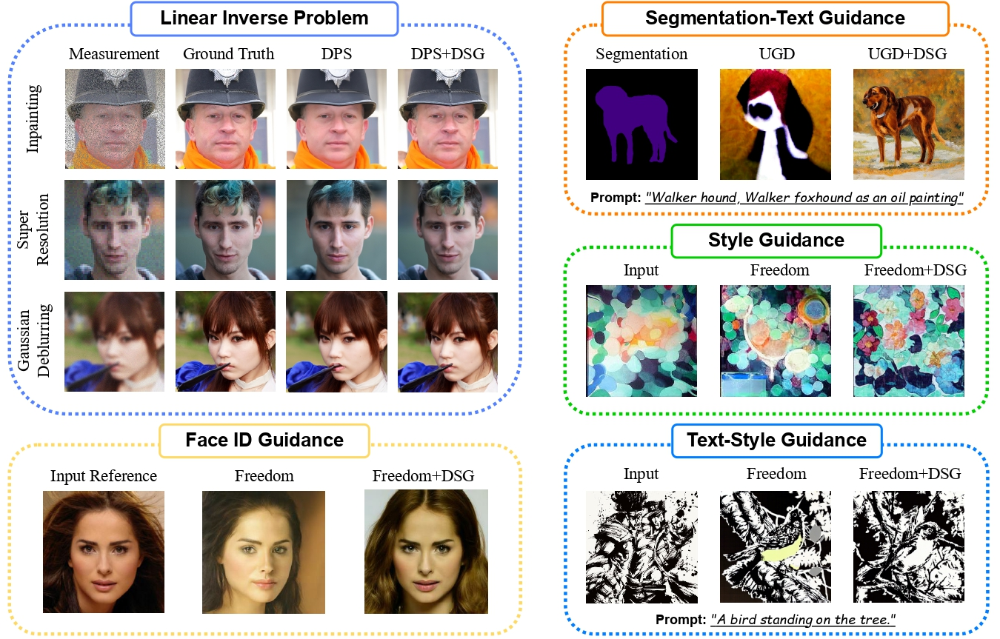

# [ICML 2024] Guidance with Spherical Gaussian Constraint for Conditional Diffusion

Code release for "Guidance with Spherical Gaussian Constraint for Conditional Diffusion(DSG)". 

[[paper]](https://arxiv.org/abs/2402.03201)



The code implementation is based on **DPS** [(https://github.com/DPS2022/diffusion-posterior-sampling)](https://github.com/DPS2022/diffusion-posterior-sampling) and 
**Freedom** [(https://github.com/vvictoryuki/FreeDoM/tree/main)](https://github.com/vvictoryuki/FreeDoM/tree/main),
including the Linear Inverse Problems and Non-linear Problems. 
See `./Linear_Inverse_Problem/README.md` and `./Non_Linear_Problems/README.md` for further details.


## Citation

If you find our work useful in your research, please consider citing

```
@inproceedings{
yang2023dsg,
title={Guidance with Spherical Gaussian Constraint for Conditional Diffusion},
author={Lingxiao Yang and Shutong Ding and Yifan Cai and Jingyi Yu and Jingya Wang and Ye Shi},
booktitle={International Conference on Machine Learning},
year={2024}
}
```


